# Проект интеллектуальной морской маршрутизации
Система для планирования маршрутов морских судов с учётом ретроспективных AIS-данных, погодных условий и зон риска.

## Сервисы

backend — основной бэкенд: FastAPI-приложение, генерация синтетических данных, ML-модели для расчёта рисков и построения маршрутов;

frontend-react — фронтенд-часть: React-приложение с картой, фильтрацией данных и отображением зон риска, морских коридоров и плотности трафика.

## Технологический стек

Backend: Python 3.12, FastAPI, Uvicorn, scikit-learn, pandas, NumPy, (опционально — PostgreSQL)

Frontend: React 18, Leaflet (карта), React-Leaflet, Axios, CSS Modules

Инфраструктура: (опционально) Docker, PostgreSQL

Менеджеры пакетов: pip, npm

## Требования

Python 3.12+

Node.js 18+

pip, npm

## Быстрый запуск (без PostgreSQL — урезанная версия)

1. Установка зависимостей
```
pip install -r requirements.txt
cd frontend-react
npm install
cd ..
```
2. Генерация синтетических данных и обучение ML-моделей
Запустите в отдельной консоли из папки backend:

```
cd backend
python train.py
python generate_current_vessels.py  # текущие суда (50 шт.)
python generate_traffic.py          # плотность трафика (traffic_density.json)
python generate_corridors.py        # морские коридоры (maritime_corridors.json)
cd ..
```

3. Запуск бэкенда
```
cd backend
python -m uvicorn app.main:app --reload --port 8000
cd ..
```
4. Запуск фронтенда (в отдельном терминале)
```
cd frontend-react
npm start
```

5. Открыть в браузере

Перейдите на ```http://localhost:3000```

## Переменные окружения

Для урезанной версии (без PostgreSQL) переменные окружения не требуются.
Все данные генерируются синтетически и хранятся в JSON-файлах в папке backend/data/.

При необходимости интеграции с реальной БД можно добавить .env со следующими параметрами:

```
POSTGRES_USER=user
POSTGRES_PASSWORD=pass
POSTGRES_HOST=localhost
POSTGRES_PORT=5432
POSTGRES_DB=maritime_db
```

## Порты и доступ к сервисам

| Сервис | URL / Порт | Описание |
| :--- | :--- | :--- |
| **Frontend (UI)** | [http://localhost:3000](http://localhost:3000) | Основное веб-приложение (React) |
| **Backend API** | [http://localhost:8000/docs](http://localhost:8000/docs) | Документация FastAPI (Swagger) |

## Скриншоты Реализации

Ниже приведены основные экраны пользовательского интерфейса системы.

<table>
    <tr>
        <td align="center" width="33%">
            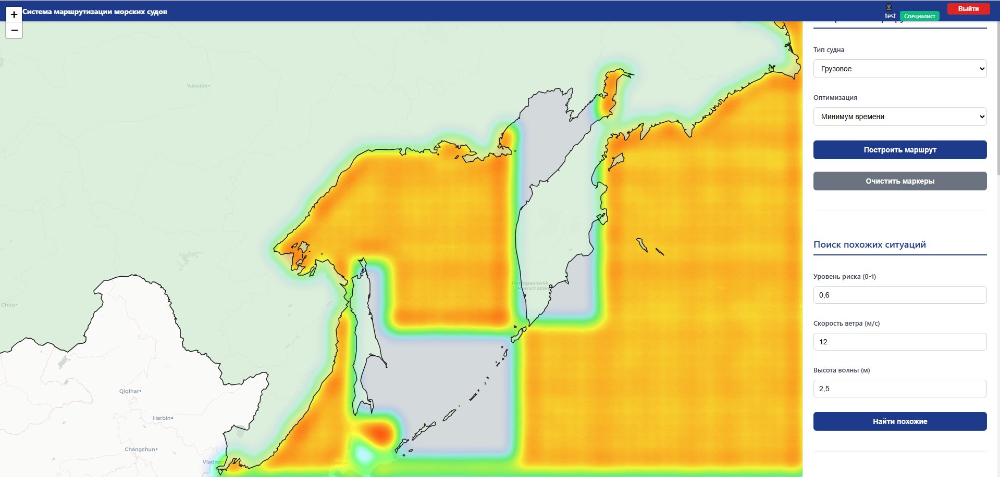
            <br /> <strong>Главный экран</strong> <br />
            Основная карта с судами и маршрутами
        </td>
        <td align="center" width="33%"> 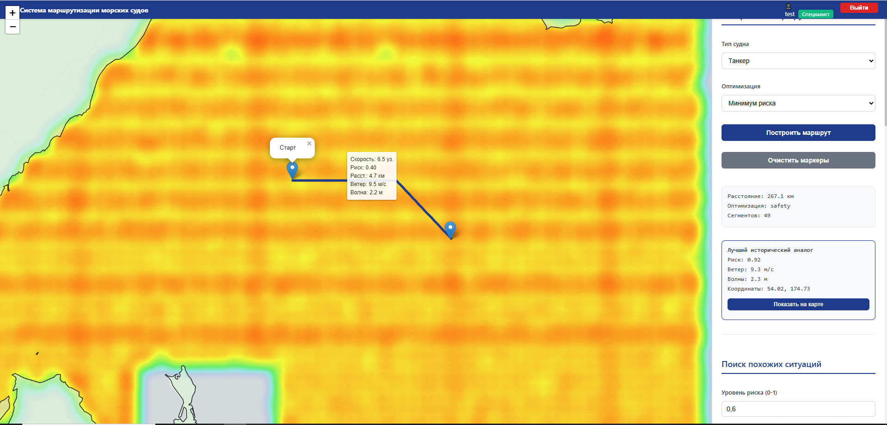
            <br /> <strong>Всплывающие подсказки</strong> <br /> Информация о судне при наведении </td>
        <td align="center" width="33%"> 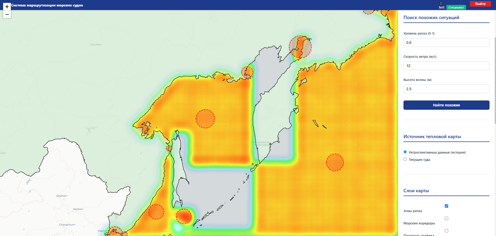 <br /> <strong>Зоны
                риска</strong> <br /> Отображение зон с высоким риском </td>
    </tr>
    <tr>
        <td align="center" width="33%"> 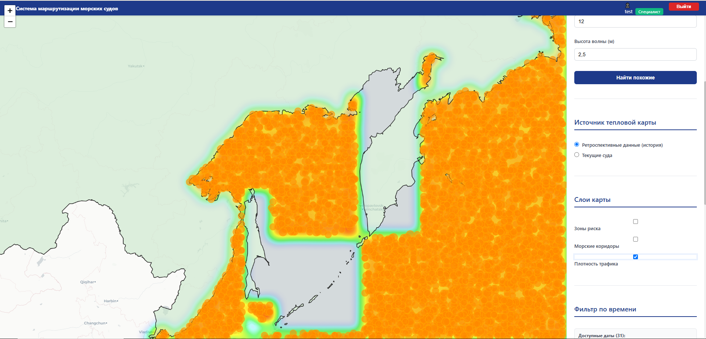 <br />
            <strong>Плотность трафика</strong> <br /> Тепловая карта интенсивности движения </td>
        <td align="center" width="33%"> 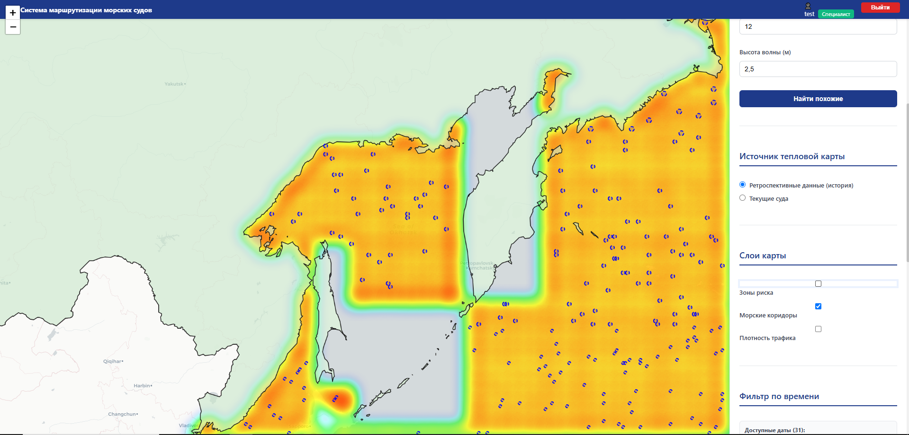 <br />
            <strong>Морские коридоры</strong> <br /> Основные маршруты судоходства </td>
        <td align="center" width="33%"> 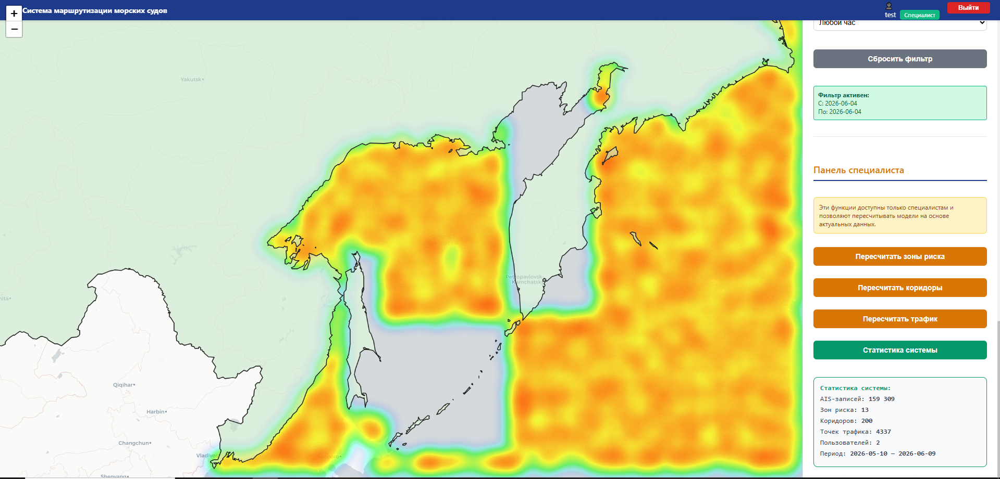 <br />
            <strong>Пересчёт зон риска</strong> <br /> Обновление зон после изменения параметров </td>
    </tr>
    <tr>
        <td align="center" width="33%"> 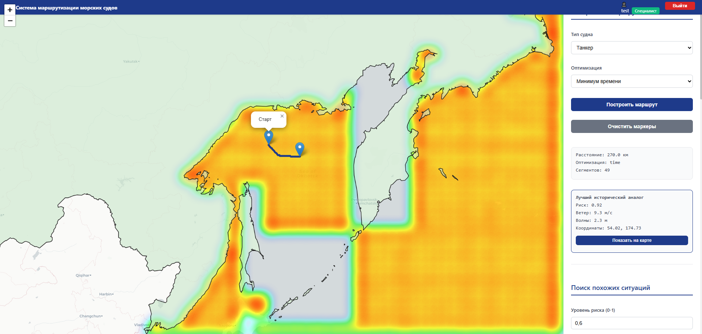
            <br /> <strong>Маршрут (минимум времени)</strong> <br /> Оптимизация по времени в пути </td>
        <td align="center" width="33%"> 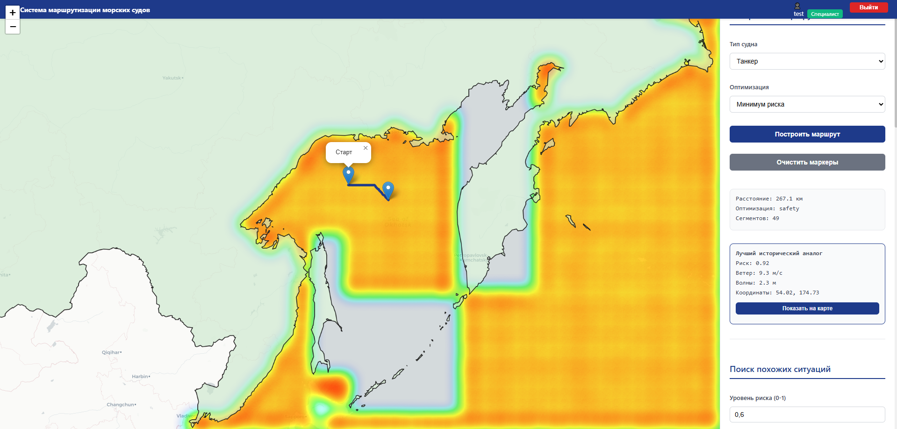
            <br /> <strong>Маршрут (минимум риска)</strong> <br /> Оптимизация по безопасности </td>
        <td align="center" width="33%"> 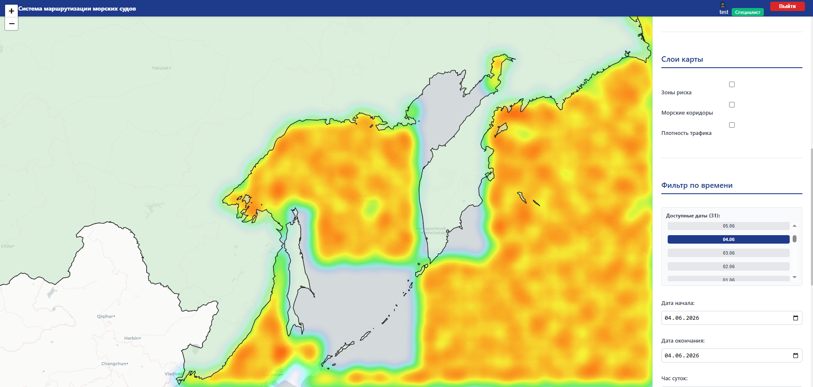 <br /> <strong>Фильтрация по дате</strong> <br /> Выбор ретроспективного
            периода </td>
    </tr>
    <tr>
        <td align="center" width="33%"> 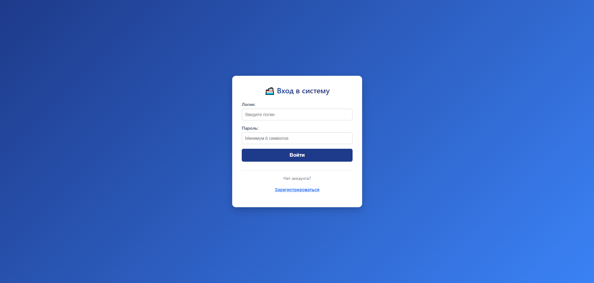 <br />
            <strong>Авторизация</strong> <br /> Форма входа в систему </td>
        <td align="center" width="33%"> 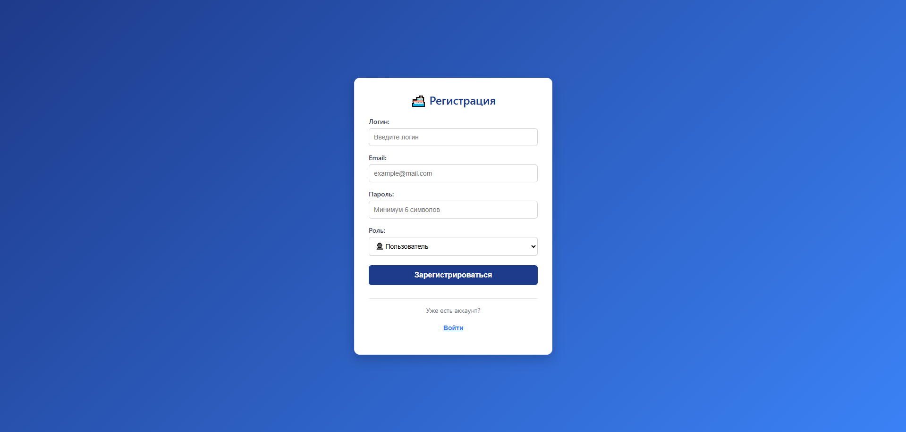 <br />
            <strong>Регистрация</strong> <br /> Форма создания учётной записи </td>
        <td align="center" width="33%"> </td>
    </tr>
</table>